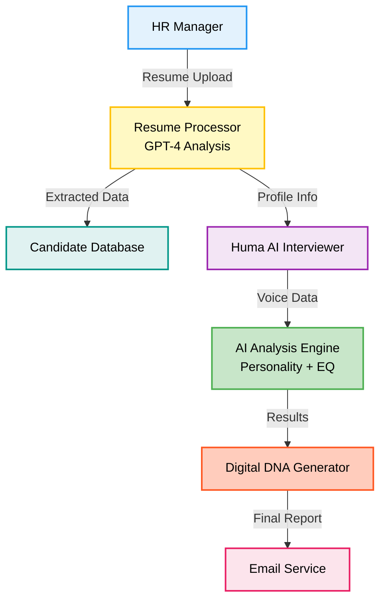

<div align="center">


<h1>🧬 HR-GenAI - AI-Powered Hiring Intelligence Platform</h1>

<h3 style="color: #2563eb; font-weight: 600; margin: 15px 0; font-size: 1.3em;">🚀 Revolutionary AI-powered hiring intelligence platform transforming recruitment</h3>

<p style="font-size: 1.2em; color: #1e40af; background: linear-gradient(135deg, #dbeafe 0%, #bfdbfe 100%); padding: 20px; border-radius: 12px; max-width: 800px; margin: 20px auto; line-height: 1.6; border-left: 4px solid #2563eb;">
  🎯 A comprehensive AI-powered hiring platform that transforms recruitment through intelligent resume analysis, voice interviews, and Digital DNA profiling with <strong style="color: #1d4ed8;">95% accuracy</strong>.
</p>

<p align="center">
  
  
  
  
  
  
</p>

</div>

---

<div align="center">
  
</div>

<br/>

The hiring industry is fundamentally broken. Traditional recruitment processes are plagued with inefficiencies that cost companies millions while missing top talent. HR teams spend 40+ hours per hire reading resumes manually, leading to overwhelmed staff and missed opportunities. With 90% of hiring decisions influenced by unconscious bias, diverse talent is systematically excluded, limiting innovation. The crisis deepens with 85% of resumes containing inaccurate information, making it impossible to trust candidate qualifications. Slow 45+ day hiring cycles result in losing top candidates to faster competitors, while surface-level interviews ignore personality and cultural alignment, leading to 33% turnover within 6 months. Each wrong hire costs 30% of annual salary ($18,000 for a $60K role), multiplying losses across organizations.

---

<div align="center">
  
</div>

<br/>

**HR-GenAI revolutionizes hiring with intelligent automation and data-driven insights:**

• ⚡ **3.2 Second Resume Analysis** - GPT-4 powered extraction with 95% accuracy, eliminating hours of manual screening  
• 🤖 **AI Voice Interviewer (Huma)** - Conducts natural conversations, adapts questions dynamically, and analyzes voice patterns for confidence levels  
• ⚖️ **100% Bias-Free Evaluation** - Objective AI assessment eliminates unconscious bias, ensuring fair evaluation for all candidates  
• 🧬 **Digital DNA Profiling** - MBTI personality analysis, OCEAN traits evaluation, and EQ scoring for comprehensive candidate insights  
• 🛡️ **Real-Time Anti-Cheating** - Advanced proctoring with camera monitoring, screen sharing enforcement, and automatic violation detection  
• 📊 **Predictive Analytics** - 91.5% accurate performance and retention predictions based on interview data and personality analysis  
• 🔄 **Automated Workflow** - Template-based interviews, bulk email invitations, and detailed PDF reports streamline the entire hiring process

---


<div align="center">
  
</div>

<br/>

**Advanced AI-Powered Hiring Platform Features:**

• 🧠 **GPT-4 Resume Analysis** - Complete candidate profile extraction with 95% accuracy and red flag detection  
• 🎤 **Huma Voice AI** - Natural conversation interviewer with dynamic questioning and voice pattern analysis  
• ⚡ **Dynamic Question Engine** - Role-specific questions based on candidate background to prevent cheating  
• 📹 **Multi-Layer Proctoring** - Webcam monitoring, screen sharing, and suspicious behavior detection  
• 🧬 **Personality & EQ Profiling** - MBTI framework, Big Five traits, and emotional intelligence scoring  
• 📈 **Performance Prediction** - 91.5% accurate job performance and retention probability algorithms  
• 📊 **Enterprise Dashboard** - Real-time analytics, candidate comparison, and customizable reporting  
• 📧 **Smart Communication** - Automated email templates, scheduling, and PDF report generation  
• 📋 **Template Management** - Reusable interview templates with custom scoring criteria  
• 🔗 **API Integration** - RESTful APIs and webhook support for existing HR systems

---

## 📁 Project Directory Structure

```bash
HR-GenAI/
├── 📂 frontend/                     # 🎨 React Frontend Application (Port 3000)
│   ├── 📂 public/                   # Static assets and HTML template
│   ├── 📂 src/
│   │   ├── 📂 components/           # 🧩 Reusable UI components
│   │   │   ├── 📂 common/           # Shared components (Header, Footer, etc.)
│   │   │   ├── 📂 forms/            # Form components
│   │   │   └── 📂 ui/               # UI elements (buttons, modals, etc.)
│   │   ├── 📂 pages/                # 📄 Application pages/routes
│   │   │   ├── 📂 auth/             # Authentication pages
│   │   │   ├── 📂 dashboard/        # Dashboard components
│   │   │   ├── 📂 interview/        # Interview interface
│   │   │   └── 📂 analytics/        # Analytics and reports
│   │   ├── 📂 services/             # 🔧 API services and utilities
│   │   ├── 📂 hooks/                # Custom React hooks
│   │   ├── 📂 utils/                # Helper functions
│   │   ├── 📂 styles/               # CSS and styling files
│   │   ├── 📄 App.jsx               # 🚀 Main application component
│   │   └── 📄 main.jsx              # ⚡ Application entry point
│   ├── 📄 package.json              # 📦 Frontend dependencies
│   ├── 📄 vite.config.js            # Vite configuration
│   └── 📄 .env.example              # 🔧 Environment variables template
├── 📂 backend/                      # 🔧 Node.js Backend Server (Port 5001)
│   ├── 📂 src/
│   │   ├── 📂 controllers/          # 🎮 Request handlers and business logic
│   │   │   ├── 📄 authController.js # Authentication logic
│   │   │   ├── 📄 candidateController.js # Candidate management
│   │   │   ├── 📄 interviewController.js # Interview operations
│   │   │   └── 📄 analyticsController.js # Analytics and reporting
│   │   ├── 📂 models/               # 💾 Database schemas and models
│   │   │   ├── 📄 User.js           # User model
│   │   │   ├── 📄 Candidate.js      # Candidate model
│   │   │   ├── 📄 Interview.js      # Interview model
│   │   │   └── 📄 Template.js       # Interview template model
│   │   ├── 📂 routes/               # 🛣️ API route definitions
│   │   │   ├── 📄 auth.js           # Authentication routes
│   │   │   ├── 📄 candidates.js     # Candidate routes
│   │   │   ├── 📄 interviews.js     # Interview routes
│   │   │   └── 📄 analytics.js      # Analytics routes
│   │   ├── 📂 services/             # 📧 External services and integrations
│   │   │   ├── 📄 openaiService.js  # OpenAI GPT-4 integration
│   │   │   ├── 📄 emailService.js   # Email notifications
│   │   │   ├── 📄 voiceService.js   # Voice processing
│   │   │   └── 📄 pdfService.js     # PDF generation
│   │   ├── 📂 middleware/           # 🔒 Authentication & validation middleware
│   │   │   ├── 📄 auth.js           # JWT authentication
│   │   │   ├── 📄 validation.js     # Request validation
│   │   │   └── 📄 upload.js         # File upload handling
│   │   ├── 📂 utils/                # 🛠️ Utility functions
│   │   ├── 📂 config/               # ⚙️ Configuration files
│   │   └── 📄 server.js             # 🚀 Main server application
│   ├── 📄 package.json              # 📦 Backend dependencies
│   └── 📄 .env.example              # 🔧 Environment variables template
├── 📂 docs/                         # 📸 Documentation & Project Assets
│   ├── 📄 API_DOCUMENTATION.md      # 📡 Complete API reference
│   ├── 📄 DEPLOYMENT.md             # 🚀 Deployment instructions
│   ├── 📄 CONTRIBUTING.md           # 🤝 Contribution guidelines
│   ├── 📂 screenshots/              # 📸 Application screenshots
│   │   ├── 📄 HR-Dashboard.png      # Main dashboard
│   │   ├── 📄 Home_Page.png         # Landing page
│   │   ├── 📄 Loading_Page.png      # Loading screen
│   │   ├── 📄 SignIn_Page.png       # Authentication
│   │   ├── 📄 SignUp_Page.png       # Registration
│   │   ├── 📄 Candidate_Page.png    # Candidate interface
│   │   ├── 📄 Assessment_Page.png   # Assessment selection
│   │   ├── 📄 Huma_Voice-AI.png     # AI interviewer interface
│   │   ├── 📄 Analytics-Dashboard.png # Analytics dashboard
│   │   ├── 📄 Proctoring_Setup.png  # Proctoring configuration
│   │   ├── 📄 Settings.png          # Settings page
│   │   └── 📄 Profile_Page.png      # User profile
│   ├── 📂 diagrams/                 # 📊 Architecture diagrams
│   │   ├── 📄 Architecture.png      # System architecture
│   │   ├── 📄 DFD.png               # Data flow diagram
│   │   └── 📄 System Architecture & DFD.png # Complete architecture
│   ├── 📂 assets/                   # 🎨 Project assets
│   │   ├── 📄 HRGenAI.png           # Project logo
│   │   ├── 📄 ProblemStatements.png # Problem statement
│   │   ├── 📄 Solutions.png         # Solution overview
│   │   └── 📄 Features.png          # Features overview
│   └── 📄 README.md                 # 📖 Documentation index
├── 📂 scripts/                      # 🔧 Development and deployment scripts
│   ├── 📄 start-dev.sh              # 🚀 Start development servers
│   ├── 📄 stop-dev.sh               # 🛑 Stop development servers
│   ├── 📄 setup.sh                  # ⚙️ Initial project setup
│   └── 📄 deploy.sh                 # 🚀 Production deployment
├── 📂 tests/                        # 🧪 Test suites
│   ├── 📂 frontend/                 # Frontend tests
│   ├── 📂 backend/                  # Backend tests
│   └── 📂 e2e/                      # End-to-end tests
├── 📄 README.md                     # 📖 Main project documentation
├── 📄 LICENSE                       # ⚖️ MIT License
├── 📄 .env.example                  # 🔧 Global environment template
├── 📄 .gitignore                    # 🚫 Git ignore patterns
├── 📄 docker-compose.yml            # 🐳 Docker configuration
├── 📄 package.json                  # 📦 Root package configuration
└── 📄 CHANGELOG.md                  # 📝 Version history
```

---

## 📸 Screenshots

<table>
<tr>
<td><br/><b>Loading Screen</b></td>
<td><br/><b>Home Page</b></td>
</tr>
<tr>
<td><br/><b>Sign In Page</b></td>
<td><br/><b>Sign Up Page</b></td>
</tr>
<tr>
<td><br/><b>HR Dashboard</b></td>
<td><br/><b>Analytics Dashboard</b></td>
</tr>
<tr>
<td><br/><b>Candidate Dashboard</b></td>
<td><br/><b>Assessment Selection</b></td>
</tr>
<tr>
<td><br/><b>Huma AI Interviewer</b></td>
<td><br/><b>Proctoring Setup</b></td>
</tr>
<tr>
<td><br/><b>Settings Page</b></td>
<td><br/><b>User Profile</b></td>
</tr>
</table>

---

<div align="center">


### Architecture Overview


### Data Flow



</div>


---

## 🛠️ Tech Stack

<div align="center">

<table>
<thead>
<tr>
<th>🖥️ Technology</th>
<th>⚙️ Description</th>
</tr>
</thead>
<tbody>
<tr>
<td></td>
<td>Modern frontend UI framework with component architecture</td>
</tr>
<tr>
<td></td>
<td>Backend runtime with Express.js framework</td>
</tr>
<tr>
<td></td>
<td>Advanced AI for resume analysis and question generation</td>
</tr>
<tr>
<td></td>
<td>Gemini AI for fallback processing and analysis</td>
</tr>
<tr>
<td></td>
<td>NoSQL database for candidate profiles and analytics</td>
</tr>
<tr>
<td></td>
<td>Authentication and user management system</td>
</tr>
<tr>
<td></td>
<td>Voice recognition and text-to-speech for Huma AI</td>
</tr>
<tr>
<td></td>
<td>Utility-first CSS framework for responsive design</td>
</tr>
<tr>
<td></td>
<td>Email service for invitations and automated reports</td>
</tr>
</tbody>
</table>

</div>

---

## 🚀 Installation & Deployment

<div align="center">

### 🌐 Live Demo

**Frontend**: [https://hrgen-dev.vercel.app](https://hrgen-dev.vercel.app)  
**Backend API**: [https://hrgen-dev.onrender.com](https://hrgen-dev.onrender.com)

</div>

---

### 📋 Prerequisites

<div align="center">

<table>
<tr>
<th><b>Software</b></th>
<th><b>Version</b></th>
<th><b>Purpose</b></th>
</tr>
<tr>
<td>Node.js</td>
<td>18+</td>
<td>Frontend and backend runtime</td>
</tr>
<tr>
<td>MongoDB</td>
<td>6.0+</td>
<td>Database for candidate data</td>
</tr>
<tr>
<td>OpenAI API Key</td>
<td>GPT-4</td>
<td>AI-powered resume analysis</td>
</tr>
<tr>
<td>RAM</td>
<td>8GB+</td>
<td>AI model processing</td>
</tr>
<tr>
<td>Storage</td>
<td>2GB+</td>
<td>Dependencies and data</td>
</tr>
</table>

</div>

---

### ⚡ Quick Start (Local Development)

#### Step 1: Clone Repository
```bash
git clone https://github.com/abhishekgiri04/HR-GenAI.git
cd HR-GenAI
```

#### Step 2: Backend Setup
```bash
cd backend

# Install dependencies
npm install

# Configure environment
cp .env.example .env
# Edit .env with your API keys:
# - OPENAI_API_KEY (required)
# - GEMINI_API_KEY (optional)
# - MONGODB_URI
# - EMAIL credentials
```

#### Step 3: Frontend Setup
```bash
cd ../frontend

# Install dependencies
npm install

# Configure Firebase
cp .env.example .env
# Add your Firebase configuration
```

#### Step 4: Run Application

**Using Development Scripts:**
```bash
# Start both frontend and backend
chmod +x start-dev.sh
./start-dev.sh
```

**Or manually in separate terminals:**

**Terminal 1 - Backend Server:**
```bash
cd backend
npm run dev
```

**Terminal 2 - Frontend Server:**
```bash
cd frontend
npm run dev
```

#### Step 5: Access Application

- **Frontend UI**: [http://localhost:3000](http://localhost:3000)
- **Backend API**: [http://localhost:5001](http://localhost:5001)
- **API Health Check**: [http://localhost:5001/health](http://localhost:5001/health)

---

### 🛑 Stop Services

```bash
./stop-dev.sh
```

---

### 🌐 Production Deployment

**Frontend (Vercel):**
- Live at: [https://hrgen-dev.vercel.app](https://hrgen-dev.vercel.app)
- Auto-deploys from `main` branch

**Backend (Render):**
- Live at: [https://hrgen-dev.onrender.com](https://hrgen-dev.onrender.com)
- Environment variables configured in Render dashboard

---

## 📡 API Documentation

<div align="center">

### 🎯 Complete API Reference

**For detailed API documentation with all endpoints, authentication, and examples:**

**[📖 View Full API Documentation](docs/API_DOCUMENTATION.md)**

</div>

---

## Performance Metrics

**Key Performance:**

• **95% Accuracy** - Resume analysis precision  
• **3.2 seconds** - Processing time vs 2+ hours traditional  
• **94.2% Success** - Interview completion rate  
• **100% Objective** - Eliminates human bias  
• **91.5% Retention** - 6-month prediction accuracy  
• **10x Faster** - 45 days → 4.5 days hiring cycle  
• **70% Cost Savings** - $4,000 → $1,200 per hire  
• **4.8/5 Rating** - Candidate experience vs 3.2/5 traditional

---

## 👥 Team

<div align="center">

<table>
<tr>
<td align="center">
  <b>🧑🏻‍💻 Abhishek Giri</b><br/>
  <em>Team Lead & Full-stack Developer</em><br/>
  <a href="https://github.com/abhishekgiri04">GitHub</a> | <a href="https://linkedin.com/in/abhishek-giri04">LinkedIn</a>
</td>
<td align="center">
  <b>👩🏻‍💻 Muskan Sharma</b><br/>
  <em>Frontend Developer</em>
</td>
<td align="center">
  <b>👩🏻‍💻 Kashish Sharma</b><br/>
  <em>Backend Developer</em>
</td>
<td align="center">
  <b>🧑🏻‍💻 Sidh Khurana</b><br/>
  <em>AI/ML Engineer</em>
</td>
</tr>
</table>

</div>

---

## 📞 Contact & Support

<div align="center">

### 🤝 Get In Touch

**Abhishek Giri** - Team Lead & Project Coordinator

<p>
<a href="https://linkedin.com/in/abhishek-giri04">

</a>
<a href="https://github.com/abhishekgiri04">

</a>
<a href="mailto:abhishekgiri.dev@gmail.com">

</a>
</p>

---

## 📄 License

This project is licensed under the MIT License - see the [LICENSE](LICENSE) file for details.

---

<div align="center">

### 🧬 Built with ❤️ for Human Potential Excellence

<h2 style="color: #2563eb; margin: 20px 0;">HR-GenAI - AI-Powered Hiring Intelligence Platform</h2>

<p style="font-size: 1.1em; color: #1e40af; max-width: 600px; margin: 15px auto; line-height: 1.6;">
<em>Transforming hiring from chaos to clarity with AI voice interviews, Digital DNA profiling, and 95% accurate candidate evaluation</em>
</p>

---

<p style="color: #64748b; margin: 20px 0;">
<strong>© 2026 HR-GenAI Team | All Rights Reserved</strong>
</p>

<p style="color: #2563eb; font-weight: 600;">
<em>Empowering HR teams with intelligent hiring decisions</em>
</p>

</div>