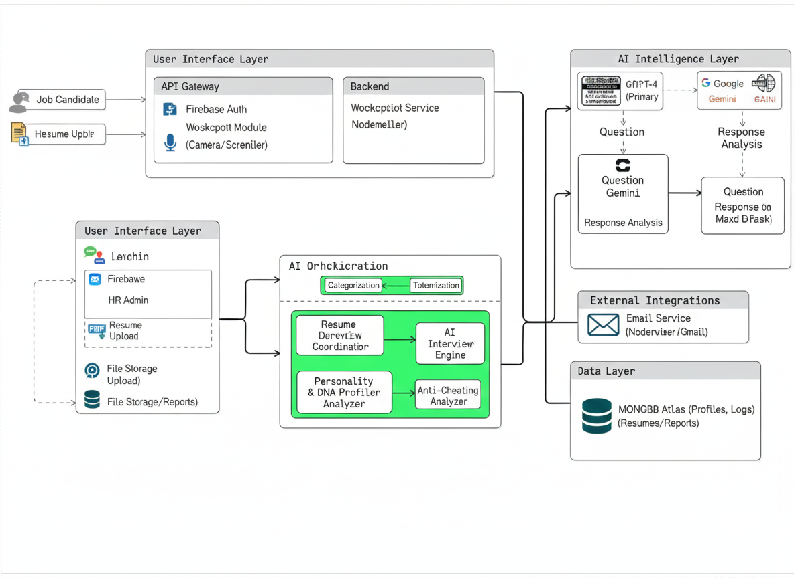

<div align="center">

<!-- README Banner -->


<br/>
<br/>

<p align="center" style="margin-top:12px;">
  
</p>

<!-- Beautiful gradient bar -->


<!-- Status badges -->
<p>
  
  
  
  
</p>

<!-- Social Media Badges -->
<p>
  <a href="https://www.linkedin.com/in/abhishek-giri04/"></a>
  <a href="https://github.com/abhishekgiri04"></a>
  <a href="https://hrgen-dev.vercel.app"></a>
</p>

<h3 style="background: linear-gradient(135deg, #667eea 0%, #764ba2 100%); -webkit-background-clip: text; -webkit-text-fill-color: transparent; background-clip: text; font-weight: 800; font-size: 1.8em; margin: 20px 0;">
  🧬 HR-GenAI — AI-Powered Hiring Intelligence Platform
</h3>

<p style="font-size: 1.2em; color: #64748b; max-width: 800px; margin: 0 auto; line-height: 1.6;">
  Transforming hiring from <strong>chaos to clarity</strong> with <strong>AI voice interviews</strong>, <strong>Digital DNA profiling</strong>, and <strong>95% accurate candidate evaluation</strong>
</p>

<br/>

<!-- Navigation -->
<div align="left">

### Table of Contents

1. <a href="#problem-statement" style="color: #667eea;"><strong>Problem Statement</strong></a>
2. <a href="#our-solution" style="color: #667eea;"><strong>Our Solution</strong></a>
3. <a href="#system-architecture" style="color: #667eea;"><strong>System Architecture</strong></a>
4. <a href="#key-features" style="color: #667eea;"><strong>Key Features</strong></a>
5. <a href="#meet-huma" style="color: #667eea;"><strong>Meet Huma - AI Interviewer</strong></a>
6. <a href="#tech-stack" style="color: #667eea;"><strong>Tech Stack</strong></a>
7. <a href="#setup-instructions" style="color: #667eea;"><strong>Setup Instructions</strong></a>
8. <a href="#screenshots" style="color: #667eea;"><strong>Screenshots</strong></a>
9. <a href="#team" style="color: #667eea;"><strong>Team</strong></a>
10. <a href="#future-scope" style="color: #667eea;"><strong>Future Scope</strong></a>

</div>

</div>


---

## Problem Statement

<div align="center">
  
</div>

<br/>

### The Reality of Traditional Hiring

Traditional hiring processes are plagued with inefficiencies that cost companies time, money, and talent:

**📊 The Numbers Don't Lie:**
- **85%** of resumes contain false information
- **60%** of new hires underperform expectations
- **33%** quit within 6 months
- **90%** of hiring decisions suffer from unconscious bias
- **40+ hours** spent per hire with 45+ day cycles

### Current Hiring Challenges

<table>
<tr>
<td align="center">
  
  <p><strong style="color: #667eea;">Manual Resume Screening</strong></p>
  <p>Hours wasted reading resumes manually</p>
</td>
<td align="center">
  
  <p><strong style="color: #667eea;">Unconscious Bias</strong></p>
  <p>Human bias affecting fair evaluation</p>
</td>
<td align="center">
  
  <p><strong style="color: #667eea;">Time Consuming Process</strong></p>
  <p>Weeks to complete hiring cycles</p>
</td>
</tr>
</table>

**This isn't just inefficiency. This is a broken system that needs intelligent automation.**


---

## Our Solution

<div align="center">
  
</div>

<br/>

### Introducing HR-GenAI: The Future of Hiring

**HR-GenAI** is a revolutionary AI-powered platform that transforms hiring through intelligent automation and data-driven insights.

### What Makes HR-GenAI Different?

#### 🧠 **AI Voice Interviewer (Huma)**
- Conducts natural voice interviews like a real HR professional
- Adapts questions based on candidate responses
- Analyzes voice patterns for confidence and stress levels

#### 📄 **GPT-4 Resume Analysis**
- Extracts complete candidate profiles with 95% accuracy
- Identifies skills, experience, and cultural fit indicators
- Flags inconsistencies and potential red flags

#### 🎲 **Dynamic Question Generation**
- Creates unique questions for each candidate based on their skills
- Prevents cheating through personalized assessments
- Adapts difficulty based on role requirements

#### 🛡️ **Strict Anti-Cheating**
- Real-time proctoring with camera and microphone monitoring
- Screen sharing enforcement during interviews
- Automatic disqualification for suspicious behavior

#### 🎭 **Personality Detection**
- MBTI personality type analysis
- OCEAN traits evaluation (Openness, Conscientiousness, etc.)
- Emotional Intelligence (EQ) scoring

#### 📊 **Predictive Analytics**
- Performance prediction based on interview data
- Retention probability calculations
- Cultural fit assessment


---

## System Architecture

<div align="center">


### 🏛️ Architecture Overview


**HR-GenAI follows a modern microservices architecture with AI-powered components:**

- **Frontend Layer**: React.js with responsive UI components
- **API Gateway**: Express.js handling all client requests
- **AI Engine**: GPT-4 & Gemini for intelligent processing
- **Database Layer**: MongoDB for scalable data storage
- **Authentication**: Firebase for secure user management
- **Real-time Communication**: WebSocket for live updates

### 📊 Data Flow Diagram


**Complete data flow from candidate onboarding to final evaluation:**

1. **Resume Processing**: PDF/DOC → AI Analysis → Structured Data
2. **Interview Orchestration**: Template Selection → Dynamic Questions → Voice/Text Responses
3. **Real-time Analysis**: Voice Emotion → Personality Traits → Performance Scoring
4. **Result Generation**: DNA Profile → Predictive Analytics → Email Reports

### 🔄 How It Works

1. **📄 Upload Resume** → AI extracts candidate info with 95% accuracy
2. **🎤 AI Interview** → Huma conducts personalized voice interviews
3. **🧬 DNA Analysis** → Creates comprehensive personality & skill profile
4. **📊 Results** → Automated email reports with hiring recommendations

</div>


---

## Key Features

<div align="center">
  
</div>

<br/>

### 🚀 Core Features

✅ **AI Voice Interviewer** — Meet Huma, your AI HR agent who conducts natural interviews  
✅ **95% Resume Accuracy** — GPT-4 powered extraction of ALL candidate details  
✅ **Dynamic Questions** — Unique questions generated based on candidate skills and template requirements  
✅ **Real-time Proctoring** — Camera, microphone, and screen sharing enforcement  
✅ **Personality Profiling** — MBTI types, OCEAN traits, and work style analysis  
✅ **EQ Analysis** — Voice confidence, stress management, and emotional intelligence  
✅ **Bias-Free Hiring** — 100% objective assessment eliminating unconscious bias  
✅ **Predictive Scoring** — Performance and retention probability predictions  
✅ **Template System** — Create reusable interview templates with scheduling  
✅ **Bulk Email Invitations** — Invite multiple candidates with one click  
✅ **Auto Email Reports** — Generate and send detailed interview results via email

### 📊 Performance Metrics

- **95% AI Accuracy** — Resume extraction and analysis precision
- **3.2 seconds** — Average resume processing time
- **94.2% Success Rate** — Interview completion rate
- **91.5% Retention** — 6-month employee retention prediction
- **100% Bias-Free** — Objective AI-powered evaluation
- **10x Faster** — Compared to traditional hiring processes


---

## Meet Huma

<div align="center">
  
</div>

<br/>

### 🤖 Meet Huma - Your AI Interviewer

**Huma** is our advanced AI HR agent who revolutionizes the interview process:

#### What Makes Huma Special?

🎤 **Speaks Naturally** — Uses text-to-speech for realistic conversations  
🧠 **Knows Your Resume** — Reads and understands every detail  
🎯 **Asks Personalized Questions** — Based on YOUR specific skills and experience  
👁️ **Monitors Behavior** — Real-time proctoring and cheating detection  
📊 **Analyzes Responses** — Voice confidence, EQ, and personality traits  
✉️ **Sends Results** — Automated email reports with detailed feedback

#### Huma's Capabilities

- **Natural Language Processing**: Understands context and nuance in responses
- **Voice Analysis**: Detects confidence levels, stress patterns, and communication skills
- **Adaptive Questioning**: Adjusts interview flow based on candidate responses
- **Real-time Evaluation**: Provides instant feedback and scoring
- **Multi-language Support**: Conducts interviews in multiple languages


---

## Tech Stack

<div align="center">

<table>
<thead>
<tr>
<th>🖥️ Technology</th>
<th>⚙️ Description</th>
</tr>
</thead>
<tbody>
<tr>
<td></td>
<td>Modern frontend with component architecture</td>
</tr>
<tr>
<td></td>
<td>Backend API with Express.js framework</td>
</tr>
<tr>
<td></td>
<td>GPT-4 for resume analysis and question generation</td>
</tr>
<tr>
<td></td>
<td>Gemini AI for fallback processing</td>
</tr>
<tr>
<td></td>
<td>NoSQL database for candidate profiles</td>
</tr>
<tr>
<td></td>
<td>Authentication and user management</td>
</tr>
<tr>
<td></td>
<td>Voice recognition and text-to-speech</td>
</tr>
<tr>
<td></td>
<td>Utility-first CSS framework</td>
</tr>
<tr>
<td></td>
<td>Email service for invitations and reports</td>
</tr>
</tbody>
</table>

</div>


---

## Setup Instructions

### 📌 Prerequisites
- ✅ **Node.js 18+** installed
- ✅ **MongoDB** installed and running
- ✅ **OpenAI API Key** (required)
- ✅ **Gemini API Key** (optional, for fallback)
- ✅ **Gmail Account** (for email notifications)

### 🚀 Quick Start

1. **Clone and setup:**

   ```bash
   git clone https://github.com/abhishekgiri04/HR-GenAI.git
   cd HR-GenAI
   ```

2. **Configure environment:**

   ```bash
   # Copy environment templates
   cp .env.example .env
   cp frontend/.env.example frontend/.env
   cp backend/.env.example backend/.env
   
   # Edit .env files with your API keys:
   # - OPENAI_API_KEY (required)
   # - GEMINI_API_KEY (optional)
   # - EMAIL_USER & EMAIL_PASS (Gmail credentials)
   # - Firebase keys in frontend/.env
   ```

3. **Install dependencies:**

   ```bash
   cd backend && npm install
   cd ../frontend && npm install
   cd ..
   ```

4. **Start all services:**

   ```bash
   chmod +x start-dev.sh
   ./start-dev.sh
   ```

5. **Access the platform:**

   ```
   Frontend: http://localhost:3000
   Backend:  http://localhost:5001
   ```

### 🛑 Stop Services

```bash
./stop-dev.sh
```


---

## Screenshots

### Loading & Authentication
<table>
  <tr>
    <td><br/><b>Loading Screen</b></td>
    <td><br/><b>Sign In Page</b></td>
  </tr>
  <tr>
    <td><br/><b>Sign Up Page</b></td>
    <td><br/><b>Main Dashboard</b></td>
  </tr>
</table>

### HR Management
<table>
  <tr>
    <td><br/><b>HR Dashboard</b></td>
    <td><br/><b>Analytics Dashboard</b></td>
  </tr>
  <tr>
    <td><br/><b>Candidate Profile</b></td>
    <td><br/><b>Assessment Selection</b></td>
  </tr>
</table>

### Interview & Assessment
<table>
  <tr>
    <td><br/><b>Proctoring Setup</b></td>
    <td><br/><b>Huma AI Interviewer</b></td>
  </tr>
  <tr>
    <td><br/><b>Settings Page</b></td>
    <td><br/><b>User Profile</b></td>
  </tr>
</table>


---

## Team

<div align="center">

<table>
<tr>
<td align="center">
  <br/>
  <strong style="font-size: 18px;">Abhishek Giri</strong><br/>
  <em>Team Lead & Full-stack Developer</em><br/>
  <a href="https://github.com/abhishekgiri04" style="color: #667eea;"><strong>GitHub</strong></a>
</td>
<td align="center">
  <br/>
  <strong style="font-size: 18px;">Muskan Sharma</strong><br/>
  <em>Frontend Developer</em><br/>
  <a href="https://github.com/muskan-sharma" style="color: #667eea;"><strong>GitHub</strong></a>
</td>
<td align="center">
  <br/>
  <strong style="font-size: 18px;">Kashish Sharma</strong><br/>
  <em>Backend Developer</em><br/>
  <a href="https://github.com/kashish-sharma" style="color: #667eea;"><strong>GitHub</strong></a>
</td>
<td align="center">
  <br/>
  <strong style="font-size: 18px;">Sidh Khurana</strong><br/>
  <em>AI/ML Engineer</em><br/>
  <a href="https://github.com/sidh-khurana" style="color: #667eea;"><strong>GitHub</strong></a>
</td>
</tr>
</table>

</div>


---

## Future Scope

### 🌱 Planned Enhancements

- 📱 **Mobile Application** — iOS and Android apps
- 🌍 **Multi-language Support** — Global hiring capabilities
- 📹 **Video Analysis** — Facial expression and body language
- 👥 **Team Compatibility** — Team fit analysis
- 🔐 **Enterprise Security** — Advanced authentication and encryption
- 📊 **Advanced Analytics** — Predictive hiring insights
- 🔗 **ATS Integration** — Connect with existing HR systems


---

## 🌐 Deployment

**🚀 Live Application:**
- **Frontend:** https://hrgen-dev.vercel.app
- **Backend API:** https://hrgen-dev.onrender.com

**API Health Check:** https://hrgen-dev.onrender.com/health

**Local Development:**
```bash
Frontend: http://localhost:3000
Backend:  http://localhost:5001
```


---

<div align="center">

## 📄 License

This project is licensed under the MIT License - see the [LICENSE](LICENSE) file for details.

</div>

---

<div align="center">

<h3><strong>Built with ❤️ for Human Potential Excellence</strong></h3>

<p style="color: #64748b; font-style: italic; font-size: 1.1em;">
"AI-Powered HR Agent: Handles resumes, interviews, and employee questions automatically"
</p>

<br/>

**© 2026 HR-GenAI. All Rights Reserved.**

<p>
  <a href="https://github.com/abhishekgiri04/HR-GenAI" style="color: #667eea;"><strong>GitHub</strong></a> •
  <a href="https://hrgen-dev.vercel.app" style="color: #667eea;"><strong>Live Demo</strong></a> •
  <a href="https://www.linkedin.com/in/abhishek-giri04/" style="color: #667eea;"><strong>Contact</strong></a>
</p>

<br/>


</div>