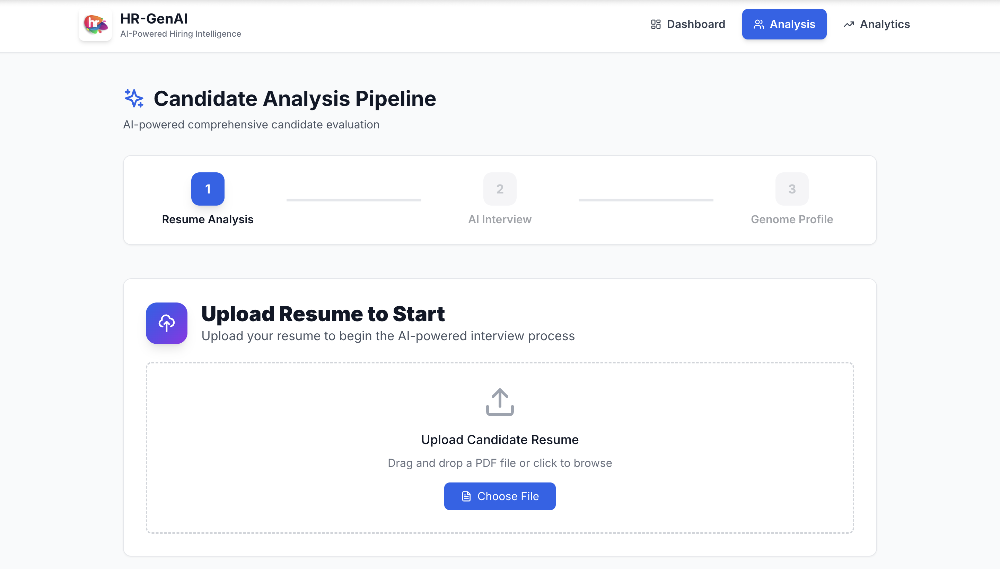
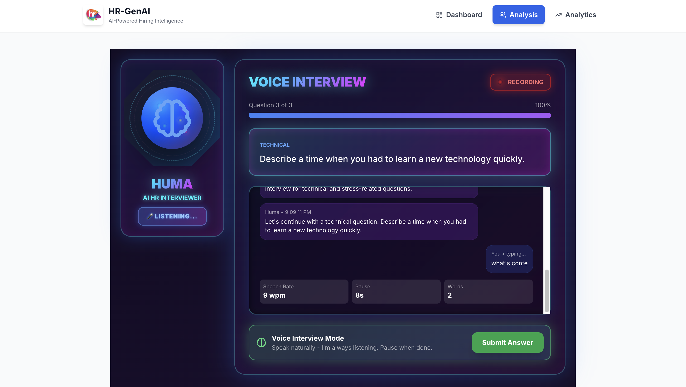
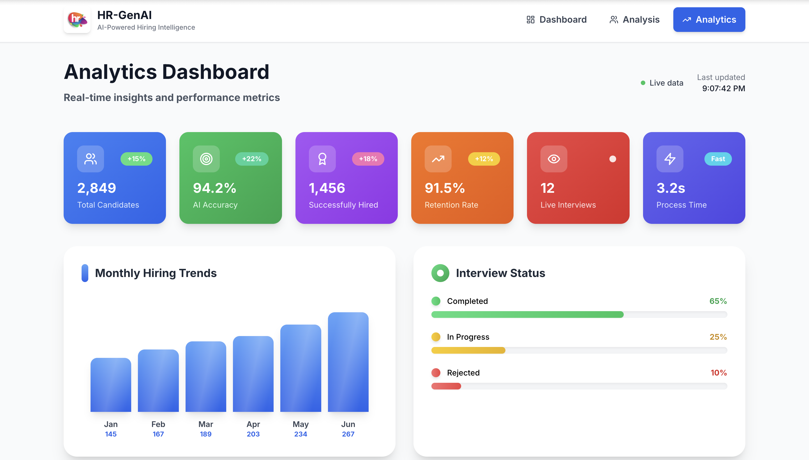

<h1 align="center">🧬 HR-GenAI — AI-Powered Hiring Intelligence Platform</h1>

<p align="center">
  🚀 A comprehensive AI-powered HR automation platform that replaces traditional hiring with intelligent, fair, and data-driven candidate evaluation through <b>Digital DNA Profiling</b> and voice-based interviews.
</p>

<p align="center">
  
  
  
  
  
  
</p>
<br>

---

## 📖 Problem Statement
Traditional hiring processes are plagued with inefficiencies: 85% of resumes contain false information, 60% of new hires underperform, 33% quit within 6 months, and 90% of decisions suffer from unconscious bias. Manual screening takes 40+ hours per hire with 45+ day cycles.

<br>

---

## 💡 Our Solution
HR-GenAI is a revolutionary AI-powered platform that transforms hiring through:

- 🧠 **AI Voice Interviewer (Huma)** — Conducts natural voice interviews like a real HR professional
- 📄 **GPT-4 Resume Analysis** — Extracts complete candidate profiles with 95% accuracy
- 🎲 **Dynamic Question Generation** — Creates unique questions for each candidate
- 🛡️ **Strict Anti-Cheating** — Real-time proctoring with automatic disqualification
- 🎭 **Personality Detection** — MBTI, OCEAN traits, and EQ analysis
- 📊 **Predictive Analytics** — Performance and retention predictions
- ✉️ **Automated Notifications** — Professional email reports with results

<br>

---  

## 🚀 Key Features

✅  **AI Voice Interviewer** — Meet Huma, your AI HR agent who conducts natural interviews  
✅  **95% Resume Accuracy** — GPT-4 powered extraction of ALL candidate details  
✅  **Random Questions** — Unique questions generated for each candidate  
✅  **Real-time Proctoring** — Camera, microphone, and screen sharing enforcement  
✅  **Personality Profiling** — MBTI types, OCEAN traits, and work style analysis  
✅  **EQ Analysis** — Voice confidence, stress management, and emotional intelligence  
✅  **Bias-Free Hiring** — 100% objective assessment eliminating unconscious bias  
✅  **Predictive Scoring** — Performance and retention probability predictions  

<br>

---  

## 🛠️ Tech Stack

<div align="center">

<table>
<thead>
<tr>
<th>🖥️ Technology</th>
<th>⚙️ Description</th>
</tr>
</thead>
<tbody>
<tr>
<td></td>
<td>Modern frontend with component architecture</td>
</tr>
<tr>
<td></td>
<td>Backend API with Express.js framework</td>
</tr>
<tr>
<td></td>
<td>GPT-4 for resume analysis and question generation</td>
</tr>
<tr>
<td></td>
<td>NoSQL database for candidate profiles</td>
</tr>
<tr>
<td></td>
<td>High-performance Python AI services</td>
</tr>
<tr>
<td></td>
<td>Voice recognition and text-to-speech</td>
</tr>
<tr>
<td></td>
<td>Utility-first CSS framework</td>
</tr>
</tbody>
</table>

</div>

<br>

---

## 📁 Project Directory Structure

```
HR-GenAI/
├── 📂 frontend/                    # 🎨 React frontend application (Port 3000)
│   ├── 📂 src/
│   │   ├── 📂 components/          # 🧩 Reusable UI components
│   │   │   ├── 📄 EnhancedAIAgent.js    # 🤖 Huma AI interviewer
│   │   │   ├── 📄 Header.js             # 🔝 Navigation header
│   │   │   ├── 📄 Footer.js             # 🔻 Footer component
│   │   │   ├── 📄 ResumeUpload.js       # 📄 File upload interface
│   │   │   ├── 📄 GenomeChart.js        # 📊 DNA visualization
│   │   │   └── 📄 TextInterview.js      # 💬 Text-based interview
│   │   ├── 📂 pages/               # 📄 Main application pages
│   │   │   ├── 📄 Dashboard.js          # 🏠 Main dashboard
│   │   │   ├── 📄 LoadingScreen.js      # ⏳ Loading animation
│   │   │   ├── 📄 CandidateAnalysis.js  # 📊 Analysis pipeline
│   │   │   ├── 📄 Analytics.js          # 📈 Real-time analytics
│   │   │   ├── 📄 GenomeProfile.js      # 🧬 DNA profile display
│   │   │   └── 📄 ProfilePage.js        # 👤 User profile
│   │   └── 📄 App.js               # 🚀 Main application
├── 📂 backend/                     # 🔧 Node.js backend service (Port 5001)
│   └── 📂 src/
│       ├── 📂 ai-engines/          # 🤖 AI processing engines
│       │   ├── 📄 skill-dna.js          # 📄 Resume extraction engine
│       │   ├── 📄 adaptive-interviewer.js # 🎯 Question generation
│       │   ├── 📄 behavior-dna.js       # 🎭 Personality analysis
│       │   └── 📄 voice-emotion-analyzer.js # 🎤 Voice analysis
│       ├── 📂 controllers/         # 🎮 API controllers
│       │   ├── 📄 candidateController.js # 👤 Candidate management
│       │   ├── 📄 analysisController.js  # 📊 Analysis processing
│       │   └── 📄 genomeController.js    # 🧬 DNA profiling
│       ├── 📂 models/              # 📋 Database models
│       │   ├── 📄 Candidate.js          # 👤 Candidate schema
│       │   └── 📄 GenomeProfile.js      # 🧬 DNA profile schema
│       ├── 📂 routes/              # 🛣️ API routes
│       ├── 📂 services/            # 📧 External services
│       │   └── 📄 emailService.js       # ✉️ Email notifications
│       └── 📄 server.js            # 🚀 Express server
├── 📂 ai-services/                 # 🤖 Python AI services (Port 8000)
│   ├── 📄 main.py                  # 🚀 FastAPI application
│   └── 📄 requirements.txt         # 📦 Python dependencies
├── 📂 docs/                        # 📸 Documentation and screenshots
│   ├── 📄 Loading_Page.png         # 🖼️ Loading screen
│   ├── 📄 Home_Page.png            # 🖼️ Dashboard page
│   ├── 📄 Analysis_Page.png        # 🖼️ Analysis pipeline
│   └── 📄 Analytics_Page.png       # 🖼️ Analytics dashboard
├── 📄 start-dev.sh                 # 🚀 Start all services
├── 📄 stop-dev.sh                  # 🛑 Stop all services
├── 📄 .env.example                 # 🔧 Environment template
└── 📄 README.md                    # 📖 Project documentation
```
<br>

## 📸 Preview Images

| 📍 Page / Feature            | 📸 Screenshot                                              |
|:----------------------------|:-----------------------------------------------------------|
| Loading Screen              |         |
| Dashboard                   |                    |
| Analysis Pipeline           |           |
| HR Bot (Huma)               |                      |
| Real-time Analytics         |     |

<br>

---

## 📦 How to Run

### 📌 Prerequisites
- ✅ **Node.js 18+** installed
- ✅ **Python 3.8+** installed  
- ✅ **MongoDB** installed and running
- ✅ **OpenAI API Key** (required)

<br>

---  

### 📌 Installation

```bash
# macOS
brew services start mongodb/brew/mongodb-community

# Ubuntu
sudo systemctl start mongod
```
<br>

### 🚀 Quick Start

1. **Clone and setup:**

   ```bash
   git clone https://github.com/abhishekgiri04/HR-GenAI.git
   cd HR-GenAI
   ```

2. **Configure environment:**

   ```bash
   cp .env.example .env
   # Add your OPENAI_API_KEY to .env file
   ```

3. **Start all services:**

   ```bash
   chmod +x start-dev.sh
   ./start-dev.sh
   ```

4. **Access the platform:**

   ```
   http://localhost:3000
   ```

### 🔧 Troubleshooting

If backend fails to start:

```bash
cd backend
npm install
cd ../frontend  
npm install
cd ..
./start-dev.sh
```
<br>

### 🛑 Stop Services

```bash
./stop-dev.sh
```
<br>

---

## 🤖 Meet Huma - Your AI Interviewer

**Huma** is our advanced AI HR agent who:

- 🎤 **Speaks naturally** — Uses text-to-speech for realistic conversations
- 🧠 **Knows your resume** — Reads and understands every detail
- 🎯 **Asks personalized questions** — Based on YOUR specific skills and experience
- 👁️ **Monitors behavior** — Real-time proctoring and cheating detection
- 📊 **Analyzes responses** — Voice confidence, EQ, and personality traits
- ✉️ **Sends results** — Automated email reports with detailed feedback

<br>

---

## 🌐 API Endpoints

```bash
# Backend API (Port 5001)
POST /api/candidates/upload     # Upload and analyze resume
GET  /api/candidates/:id        # Get candidate profile
GET  /api/candidates/:id/questions # Get dynamic questions
POST /api/analysis/interview    # Process interview responses
POST /api/analysis/followup     # Generate follow-up questions
GET  /health                    # Health check

# AI Services API (Port 8000) - Optional
GET  /                          # Service status
```
<br>

---

## 🧪 Testing

```bash
# Test backend API
curl http://localhost:5001/health

# Test AI services (if running)
curl http://localhost:8000/

# Test frontend
npm run test
```

## ⚠️ Common Issues

**MongoDB connection failed:**
```bash
brew services start mongodb/brew/mongodb-community  # macOS
sudo systemctl start mongod                          # Linux
```

**OpenAI API errors:**
- Ensure valid API key in `.env` file
- Check API quota and billing

**Port conflicts:**
- Frontend: 3000
- Backend: 5001  
- AI Services: 8000 (optional)

**Voice not working:**
- Use Chrome browser
- Allow microphone permissions
- Test voice with the "TEST VOICE" button

<br>

---

## 🔧 Environment Setup

Create `.env` file in root directory:

```env
# Database
MONGODB_URI=mongodb://localhost:27017/hr-genai

# OpenAI (REQUIRED)
OPENAI_API_KEY=your_openai_api_key_here

# Email (Optional)
EMAIL_USER=your-email@gmail.com
EMAIL_PASSWORD=your-app-password

# Server
PORT=5001
NODE_ENV=development
```
<br>

---

## 📊 Performance Metrics

- **95% AI Accuracy** — Resume extraction and analysis precision
- **3.2 seconds** — Average resume processing time
- **94.2% Success Rate** — Interview completion rate
- **91.5% Retention** — 6-month employee retention prediction
- **100% Bias-Free** — Objective AI-powered evaluation
- **10x Faster** — Compared to traditional hiring processes

<br>

---

## 🎯 Core Workflow

1. **📄 Resume Upload** → GPT-4 extracts complete candidate profile
2. **🎲 Question Generation** → AI creates unique questions per candidate  
3. **📝 Text Interview** → Basic questions in text format
4. **🎤 Voice Interview** → Technical questions with Huma AI
5. **🛡️ Real-time Proctoring** → Camera, mic, screen sharing enforcement
6. **🧬 DNA Analysis** → Personality, EQ, and behavioral profiling
7. **📊 Predictive Scoring** → Performance and retention predictions
8. **✉️ Email Reports** → Automated results and recommendations

<br>

---

## 🌱 Future Scope
- 📱 **Mobile Application** — iOS and Android apps
- 🌍 **Multi-language Support** — Global hiring capabilities
- 📹 **Video Analysis** — Facial expression and body language
- 👥 **Team Compatibility** — Team fit analysis
- 🔐 **Enterprise Security** — Advanced authentication and encryption
- 📊 **Advanced Analytics** — Predictive hiring insights

<br>

---  

## 👥 Team

| Member | Role | Contribution |
|--------|------|--------------|
| **Abhishek Giri** | Team Lead | Architecture, AI Integration, Full-stack Development |
| **Muskan Sharma** | Frontend Developer | React UI, Data Visualization |
| **Kashish Sharma** | Backend Developer | APIs, Database Design |
| **Sidh Khurana** | AI/ML Engineer | AI Models, Analysis Algorithms |

<br>

---

## 📞 Help & Contact  

> 💬 *Got questions or need assistance with HR-GenAI?*  
> We're here to help with technical support and collaboration!

<div align="center">

**👤 Abhishek Giri - Team Lead**  
<a href="https://www.linkedin.com/in/abhishek-giri04/">
  
</a>  
<a href="https://github.com/abhishekgiri04">
  
</a>  
<a href="https://t.me/AbhishekGiri7">
  
</a>

<br/>

---

**🧬 Built with ❤️ for Human Potential Excellence**  
*AI-Powered HR Agent: Handles resumes, interviews, and employee questions automatically*

</div>

---

<div align="center">

**© 2025 HR-GenAI. All Rights Reserved.**

⭐ Star this repo if you find it useful!

</div>