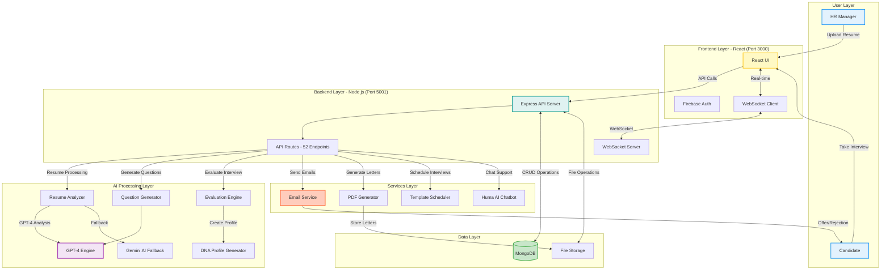

<div align="center">


<h1>💡 HR-GenAI — AI-Powered Hiring Intelligence Platform</h1>

<p style="color: #2563eb; margin: 15px 0; font-size: 1.1em;">🚀 A revolutionary AI-powered hiring intelligence platform that transforms recruitment by combining intelligent resume analysis, AI-driven voice interviews, and proprietary Digital DNA Profiling to deliver up to 95% accuracy in candidate evaluation—enabling faster, fairer, and data-driven hiring decisions at scale.</p>

<p style="font-size: 1.2em; color: #1e40af; background: linear-gradient(135deg, #dbeafe 0%, #bfdbfe 100%); padding: 20px; border-radius: 12px; max-width: 800px; margin: 20px auto; line-height: 1.6; border-left: 4px solid #2563eb;">
</p>

<p align="center">
  
  
  
  
  
  
</p>

</div>

---

<div align="center">
  
</div>

<br/>

The hiring industry is fundamentally broken. Traditional recruitment processes are plagued with inefficiencies that cost companies millions while missing top talent. HR teams spend 40+ hours per hire reading resumes manually, leading to overwhelmed staff and missed opportunities. With 90% of hiring decisions influenced by unconscious bias, diverse talent is systematically excluded, limiting innovation. The crisis deepens with 85% of resumes containing inaccurate information, making it impossible to trust candidate qualifications. Slow 45+ day hiring cycles result in losing top candidates to faster competitors, while surface-level interviews ignore personality and cultural alignment, leading to 33% turnover within 6 months. Each wrong hire costs 30% of annual salary ($18,000 for a $60K role), multiplying losses across organizations.

---

<div align="center">
  
</div>

<br/>

**HR-GenAI revolutionizes hiring with intelligent automation and data-driven insights:**

• **3.2 Second Resume Analysis** - GPT-4 powered extraction with 95% accuracy, eliminating hours of manual screening  
• **AI Voice Interviewer (Huma)** - Conducts natural conversations, adapts questions dynamically, and analyzes voice patterns for confidence levels  
• **100% Bias-Free Evaluation** - Objective AI assessment eliminates unconscious bias, ensuring fair evaluation for all candidates  
• **Digital DNA Profiling** - MBTI personality analysis, OCEAN traits evaluation, and EQ scoring for comprehensive candidate insights  
• **Real-Time Anti-Cheating** - Advanced proctoring with camera monitoring, screen sharing enforcement, and automatic violation detection  
• **Predictive Analytics** - 91.5% accurate performance and retention predictions based on interview data and personality analysis  
• **Automated Workflow** - Template-based interviews, bulk email invitations, and detailed PDF reports streamline the entire hiring process

---


<div align="center">
  
</div>

<br/>

**Advanced AI-Powered Hiring Platform Features:**

• **GPT-4 Resume Analysis** - Complete candidate profile extraction with 95% accuracy and red flag detection  
• **Huma Voice AI** - Natural conversation interviewer with dynamic questioning and voice pattern analysis  
• **Dynamic Question Engine** - Role-specific questions based on candidate background to prevent cheating  
• **Multi-Layer Proctoring** - Webcam monitoring, screen sharing, and suspicious behavior detection  
• **Personality & EQ Profiling** - MBTI framework, Big Five traits, and emotional intelligence scoring  
• **Performance Prediction** - 91.5% accurate job performance and retention probability algorithms  
• **Enterprise Dashboard** - Real-time analytics, candidate comparison, and customizable reporting  
• **Smart Communication** - Automated email templates, scheduling, and PDF report generation  
• **Template Management** - Reusable interview templates with custom scoring criteria  
• **API Integration** - RESTful APIs and webhook support for existing HR systems

---

## 📁 Project Directory Structure

```
HR-GenAI/
├── 📂 frontend/                           # React Frontend (Port 3000)
│   ├── 📂 public/
│   │   └── 📄 index.html                  # Main HTML template
│   ├── 📂 src/
│   │   ├── 📂 components/                 # Reusable UI Components
│   │   │   ├── 📄 AIAgent.js              # AI assistant chatbot
│   │   │   ├── 📄 AutoEvaluationTrigger.js # Auto-evaluation trigger
│   │   │   ├── 📄 BulkInviteModal.js      # Bulk email invitation modal
│   │   │   ├── 📄 CandidateEvaluation.js  # Candidate evaluation UI
│   │   │   ├── 📄 ConfirmModal.js         # Confirmation dialog
│   │   │   ├── 📄 CreateTemplateModal.js  # Template creation modal
│   │   │   ├── 📄 EmbeddedResumeViewer.js # Inline PDF resume viewer
│   │   │   ├── 📄 Footer.js               # Page footer
│   │   │   ├── 📄 GenomeChart.js          # DNA profile visualization
│   │   │   ├── 📄 Header.js               # Navigation header
│   │   │   ├── 📄 HumaChat.js             # Huma AI chatbot interface
│   │   │   ├── 📄 InterviewManager.js     # Interview management
│   │   │   ├── 📄 InterviewScheduler.js   # Interview scheduling
│   │   │   ├── 📄 notificationTemplates.js # Notification templates
│   │   │   ├── 📄 ProtectedRoute.js       # Route authentication guard
│   │   │   ├── 📄 QuickHire.js            # Quick hire component
│   │   │   ├── 📄 ResumeUpload.js         # Resume upload interface
│   │   │   ├── 📄 RoleSelection.js        # User role selector
│   │   │   ├── 📄 StatsCard.js            # Statistics card component
│   │   │   ├── 📄 TemplateBasedInterview.js # Template interview UI
│   │   │   ├── 📄 TemplateNotification.js # Template notifications
│   │   │   ├── 📄 TemplateSelection.js    # Template selector
│   │   │   ├── 📄 TextInterview.js        # Text-based interview
│   │   │   ├── 📄 TimedCulturalInterview.js # Timed cultural fit test
│   │   │   ├── 📄 Toast.js                # Toast notifications
│   │   │   └── 📄 VoiceInterviewBox.js    # Voice interview UI
│   │   ├── 📂 pages/                      # Application Pages
│   │   │   ├── 📄 AnalyticsPage.js        # Analytics dashboard
│   │   │   ├── 📄 CandidateInterviewPage.js # Candidate interview page
│   │   │   ├── 📄 CandidateProfilePage.js # Candidate profile view
│   │   │   ├── 📄 DashboardPage.js        # Main dashboard
│   │   │   ├── 📄 GenomeProfilePage.js    # DNA profile page
│   │   │   ├── 📄 HRDashboardPage.js      # HR management panel
│   │   │   ├── 📄 InterviewPage.js        # Interview interface
│   │   │   ├── 📄 LoadingPage.js          # Loading screen
│   │   │   ├── 📄 SettingsPage.js         # User settings
│   │   │   ├── 📄 SignInPage.js           # User authentication
│   │   │   ├── 📄 SignUpPage.js           # User registration
│   │   │   └── 📄 UserProfilePage.js      # User profile page
│   │   ├── 📂 services/                   # API Services
│   │   │   └── 📄 websocketService.js     # WebSocket connections
│   │   ├── 📂 contexts/                   # React Contexts
│   │   │   └── 📄 authContext.js          # Authentication context
│   │   ├── 📂 firebase/                   # Firebase Configuration
│   │   │   └── 📄 firebaseConfig.js       # Firebase setup
│   │   ├── 📂 hooks/                      # Custom React Hooks
│   │   │   └── 📄 useTemplateNotifications.js # Template notifications hook
│   │   ├── 📂 config/                     # Configuration Files
│   │   │   └── 📄 api.js                  # API endpoints config
│   │   ├── 📂 styles/                     # CSS Stylesheets
│   │   │   └── 📄 main.css                # Main stylesheet
│   │   ├── 📂 utils/                      # Utility Functions
│   │   │   └── 📄 toast.js                # Toast utility
│   │   ├── 📄 ai-animation-flow.json      # AI animation data
│   │   ├── 📄 loading-loop-animation.json # Loading animation
│   │   ├── 📄 robot-ai-animation.json     # Robot animation
│   │   ├── 📄 App.js                      # Main application
│   │   ├── 📄 index.js                    # Entry point
│   │   └── 📄 index.css                   # Global styles
│   ├── 📄 package.json                    # Frontend dependencies
│   ├── 📄 tailwind.config.js              # Tailwind CSS config
│   └── 📄 .env.example                    # Environment template
├── 📂 backend/                            # Node.js Backend (Port 5001)
│   ├── 📂 src/
│   │   ├── 📂 ai-engines/                 # AI Processing Engines
│   │   │   ├── 📄 InterviewAIEngine.js    # Core interview AI logic
│   │   │   ├── 📄 intelligent-question-generator.js # Dynamic question generation
│   │   │   ├── 📄 skill-dna.js            # Skill DNA profiling
│   │   │   ├── 📄 smartMessageGenerator.js # Smart message generation
│   │   │   └── 📄 template-question-generator.js # Template questions
│   │   ├── 📂 controllers/                # Business Logic Controllers
│   │   │   ├── 📄 candidateController.js  # Candidate CRUD operations
│   │   │   └── 📄 genomeController.js     # DNA profile operations
│   │   ├── 📂 models/                     # MongoDB Schemas
│   │   │   ├── 📄 Candidate.js            # Candidate schema
│   │   │   ├── 📄 GenomeProfile.js        # DNA profile schema
│   │   │   ├── 📄 Interview.js            # Interview schema
│   │   │   └── 📄 Template.js             # Template schema
│   │   ├── 📂 routes/                     # API Routes (52 endpoints)
│   │   │   ├── 📄 aiCompletion.js         # AI completion endpoints
│   │   │   ├── 📄 analytics.js            # Analytics endpoints
│   │   │   ├── 📄 autoEval.js             # Auto-evaluation endpoints
│   │   │   ├── 📄 autoHire.js             # Auto-hire endpoints
│   │   │   ├── 📄 autoSchedule.js         # Auto-scheduling endpoints
│   │   │   ├── 📄 candidates.js           # Candidate CRUD endpoints
│   │   │   ├── 📄 evaluation.js           # Evaluation endpoints
│   │   │   ├── 📄 genome.js               # DNA profile endpoints
│   │   │   ├── 📄 hrInterview.js          # HR interview endpoints
│   │   │   ├── 📄 huma.js                 # Huma AI chatbot endpoints
│   │   │   ├── 📄 interview.js            # Interview endpoints
│   │   │   ├── 📄 invitations.js          # Email invitation endpoints
│   │   │   └── 📄 templates.js            # Template CRUD endpoints
│   │   ├── 📂 services/                   # External Services
│   │   │   ├── 📄 autoEvaluationService.js # Auto-evaluation service
│   │   │   ├── 📄 autoInterviewScheduler.js # Auto-scheduling service
│   │   │   ├── 📄 emailService.js         # Email notifications (Nodemailer)
│   │   │   ├── 📄 humaAIService.js        # Huma AI service
│   │   │   ├── 📄 interviewEvaluationService.js # Interview evaluation
│   │   │   ├── 📄 letterGenerationService.js # PDF letter generation
│   │   │   ├── 📄 templateScheduler.js    # Template scheduling
│   │   │   └── 📄 websocketService.js     # Real-time WebSocket
│   │   ├── 📂 config/                     # Configuration
│   │   │   └── 📄 database.js             # MongoDB connection
│   │   ├── 📂 scripts/                    # Utility Scripts
│   │   │   └── 📄 seedTemplates.js        # Database seeding
│   │   └── 📄 server.js                   # Express server entry
│   ├── 📂 uploads/                        # File Uploads
│   │   ├── 📂 documents/                  # Resume PDFs
│   │   ├── 📂 letters/                    # Generated offer/rejection letters
│   │   └── 📂 temp/                       # Temporary files
│   ├── 📄 package.json                    # Backend dependencies
│   └── 📄 .env.example                    # Environment template
├── 📂 data/                               # Sample Data
│   ├── 📄 employee_data.csv               # Employee dataset
│   └── 📄 hr_policy.txt                   # HR policy document
├── 📂 docs/                               # Documentation & Assets
│   ├── 📄 API_DOCUMENTATION.md            # Complete API reference
│   ├── 📄 HRGenAI.jpeg                    # Project logo
│   ├── 📄 CodeCatalyst.jpg                # Team photo
│   ├── 📄 ProblemStatements.png           # Problem overview
│   ├── 📄 Solutions.png                   # Solution overview
│   ├── 📄 Features.png                    # Features overview
│   ├── 📄 Architecture.png                # Architecture diagram
│   ├── 📄 System_Architecture.png         # System architecture
│   ├── 📄 Loading_Page.png                # Loading screen
│   ├── 📄 Home_Page.png                   # Home page
│   ├── 📄 SignIn_Page.png                 # Sign in page
│   ├── 📄 SignUp_Page.png                 # Sign up page
│   ├── 📄 HR-Dashboard.png                # HR dashboard
│   ├── 📄 Analytics-Dashboard.png         # Analytics dashboard
│   ├── 📄 Candidate_Page.png              # Candidate page
│   ├── 📄 Assesment_Page.png              # Assessment page
│   ├── 📄 Huma_Voice-AI.png               # Voice AI interface
│   ├── 📄 Proctoring_Setup.png            # Proctoring setup
│   ├── 📄 Settings.png                    # Settings page
│   ├── 📄 Profile_Page.png                # Profile page
│   ├── 📄 AbhishekGiri.jpg                # Team member photo
│   ├── 📄 MuskanSharma.jpeg               # Team member photo
│   ├── 📄 KashishSharma.jpeg              # Team member photo
│   └── 📄 SidhKhurana.jpeg                # Team member photo
├── 📄 start-dev.sh                        # Start development servers
├── 📄 stop-dev.sh                         # Stop development servers
├── 📄 vercel.json                         # Vercel deployment config
├── 📄 .env.example                        # Root environment template
├── 📄 .gitignore                          # Git ignore patterns
├── 📄 LICENSE                             # MIT License
└── 📄 README.md                           # Project documentation
```

---

## 📸 Screenshots

<table>
<tr>
<td><br/><b>Loading Screen</b></td>
<td><br/><b>Home Page</b></td>
</tr>
<tr>
<td><br/><b>Sign In Page</b></td>
<td><br/><b>Sign Up Page</b></td>
</tr>
<tr>
<td><br/><b>HR Dashboard</b></td>
<td><br/><b>Analytics Dashboard</b></td>
</tr>
<tr>
<td><br/><b>Candidate Dashboard</b></td>
<td><br/><b>Assessment Selection</b></td>
</tr>
<tr>
<td><br/><b>Huma AI Interviewer</b></td>
<td><br/><b>Proctoring Setup</b></td>
</tr>
<tr>
<td><br/><b>Settings Page</b></td>
<td><br/><b>User Profile</b></td>
</tr>
</table>

---

<div align="center">


### Architecture Overview


### Data Flow Diagram (DFD)



</div>


---

## 🛠️ Tech Stack

<div align="center">

<table>
<thead>
<tr>
<th>🖥️ Technology</th>
<th>⚙️ Description</th>
</tr>
</thead>
<tbody>
<tr>
<td></td>
<td>Modern frontend UI framework with component architecture</td>
</tr>
<tr>
<td></td>
<td>Backend runtime with Express.js framework</td>
</tr>
<tr>
<td></td>
<td>Advanced AI for resume analysis and question generation</td>
</tr>
<tr>
<td></td>
<td>Gemini AI for fallback processing and analysis</td>
</tr>
<tr>
<td></td>
<td>NoSQL database for candidate profiles and analytics</td>
</tr>
<tr>
<td></td>
<td>Authentication and user management system</td>
</tr>
<tr>
<td></td>
<td>Voice recognition and text-to-speech for Huma AI</td>
</tr>
<tr>
<td></td>
<td>Utility-first CSS framework for responsive design</td>
</tr>
<tr>
<td></td>
<td>Email service for invitations and automated reports</td>
</tr>
</tbody>
</table>

</div>

---

## 🚀 Installation & Deployment

<div align="center">

### 🌐 Live Demo

**Frontend**: [https://hrgen-dev.vercel.app](https://hrgen-dev.vercel.app)  
**Backend API**: [https://hrgen-dev.onrender.com](https://hrgen-dev.onrender.com)

</div>

---

### 📋 Prerequisites

<div align="center">

<table>
<tr>
<th><b>Software</b></th>
<th><b>Version</b></th>
<th><b>Purpose</b></th>
</tr>
<tr>
<td>Node.js</td>
<td>18+</td>
<td>Frontend and backend runtime</td>
</tr>
<tr>
<td>MongoDB</td>
<td>6.0+</td>
<td>Database for candidate data</td>
</tr>
<tr>
<td>OpenAI API Key</td>
<td>GPT-4</td>
<td>AI-powered resume analysis</td>
</tr>
<tr>
<td>RAM</td>
<td>8GB+</td>
<td>AI model processing</td>
</tr>
<tr>
<td>Storage</td>
<td>2GB+</td>
<td>Dependencies and data</td>
</tr>
</table>

</div>

---

### ⚡ Quick Start (Local Development)

#### Step 1: Clone Repository
```bash
git clone https://github.com/abhishekgiri04/HR-GenAI.git
cd HR-GenAI
```

#### Step 2: Backend Setup
```bash
cd backend

# Install dependencies
npm install

# Configure environment
cp .env.example .env
# Edit .env with your API keys:
# - OPENAI_API_KEY (required)
# - GEMINI_API_KEY (optional)
# - MONGODB_URI
# - EMAIL credentials
```

#### Step 3: Frontend Setup
```bash
cd ../frontend

# Install dependencies
npm install

# Configure Firebase
cp .env.example .env
# Add your Firebase configuration
```

#### Step 4: Run Application

**Using Development Scripts:**
```bash
# Start both frontend and backend
chmod +x start-dev.sh
./start-dev.sh
```

**Or manually in separate terminals:**

**Terminal 1 - Backend Server:**
```bash
cd backend
npm run dev
```

**Terminal 2 - Frontend Server:**
```bash
cd frontend
npm run dev
```

#### Step 5: Access Application

- **Frontend UI**: [http://localhost:3000](http://localhost:3000)
- **Backend API**: [http://localhost:5001](http://localhost:5001)
- **API Health Check**: [http://localhost:5001/health](http://localhost:5001/health)

---

### 🛑 Stop Services

```bash
./stop-dev.sh
```

---

### 🌐 Production Deployment

**Frontend (Vercel):**
- Live at: [https://hrgen-dev.vercel.app](https://hrgen-dev.vercel.app)
- Auto-deploys from `main` branch

**Backend (Render):**
- Live at: [https://hrgen-dev.onrender.com](https://hrgen-dev.onrender.com)
- Environment variables configured in Render dashboard

---

## 📡 API Documentation

<div align="center">

### Complete API Reference

**For detailed API documentation with all endpoints, authentication, and examples:**

**[📖 View Full API Documentation](docs/API_DOCUMENTATION.md)**

</div>

---

## Performance Metrics

<div align="center">

<table>
<tr>
<th style="background: linear-gradient(135deg, #667eea 0%, #764ba2 100%); color: white; padding: 15px;"><b>Metric</b></th>
<th style="background: linear-gradient(135deg, #667eea 0%, #764ba2 100%); color: white; padding: 15px;"><b>Performance</b></th>
<th style="background: linear-gradient(135deg, #667eea 0%, #764ba2 100%); color: white; padding: 15px;"><b>Impact</b></th>
</tr>
<tr>
<td style="padding: 12px; border-left: 4px solid #4CAF50;"><b>Resume Analysis Accuracy</b></td>
<td style="padding: 12px; color: #2E7D32; font-weight: bold;">95%</td>
<td style="padding: 12px;">Precision in candidate evaluation</td>
</tr>
<tr>
<td style="padding: 12px; border-left: 4px solid #FF9800;"><b>Processing Speed</b></td>
<td style="padding: 12px; color: #E65100; font-weight: bold;">3.2 seconds</td>
<td style="padding: 12px;">vs 2+ hours traditional screening</td>
</tr>
<tr>
<td style="padding: 12px; border-left: 4px solid #2196F3;"><b>Interview Completion</b></td>
<td style="padding: 12px; color: #1565C0; font-weight: bold;">94.2%</td>
<td style="padding: 12px;">High candidate engagement rate</td>
</tr>
<tr>
<td style="padding: 12px; border-left: 4px solid #9C27B0;"><b>Bias Elimination</b></td>
<td style="padding: 12px; color: #7B1FA2; font-weight: bold;">100%</td>
<td style="padding: 12px;">Objective AI assessment</td>
</tr>
<tr>
<td style="padding: 12px; border-left: 4px solid #4CAF50;"><b>Retention Prediction</b></td>
<td style="padding: 12px; color: #2E7D32; font-weight: bold;">91.5%</td>
<td style="padding: 12px;">6-month accuracy forecast</td>
</tr>
<tr>
<td style="padding: 12px; border-left: 4px solid #FF5722;"><b>Hiring Speed</b></td>
<td style="padding: 12px; color: #D84315; font-weight: bold;">10x Faster</td>
<td style="padding: 12px;">45 days → 4.5 days cycle</td>
</tr>
<tr>
<td style="padding: 12px; border-left: 4px solid #607D8B;"><b>Cost Reduction</b></td>
<td style="padding: 12px; color: #37474F; font-weight: bold;">70%</td>
<td style="padding: 12px;">$4,000 → $1,200 per hire</td>
</tr>
<tr>
<td style="padding: 12px; border-left: 4px solid #795548;"><b>Candidate Experience</b></td>
<td style="padding: 12px; color: #5D4037; font-weight: bold;">4.8/5</td>
<td style="padding: 12px;">vs 3.2/5 traditional rating</td>
</tr>
</table>

</div>

---


<div align="center">

## 👥 Team

<table>
<tr>
<td align="center">
  <br/>
  <b>💻 Abhishek Giri</b><br/>
  <em>Team Lead & Full-stack Developer</em><br/>
  <a href="https://github.com/abhishekgiri04">
    
  </a>
  <a href="https://linkedin.com/in/abhishek-giri04">
    
  </a>
</td>
<td align="center">
  <br/>
  <b>💻 Muskan Sharma</b><br/>
  <em>Frontend Developer</em><br/>
  <a href="https://github.com/MuskanSharma2006">
    
  </a>
</td>
<td align="center">
  <br/>
  <b>💻 Kashish Sharma</b><br/>
  <em>Backend Developer</em><br/>
  <a href="https://github.com/KashishSharma11">
    
  </a>
</td>
<td align="center">
  <br/>
  <b>💻 Sidh Khurana</b><br/>
  <em>AI/ML Engineer</em><br/>
  <a href="https://github.com/Sidh1818">
    
  </a>
</td>
</tr>
</table>

</div>

---


## 📞 Contact

> 💬 *Got questions or need assistance with HR-GenAI Platform?*  
> We're here to help with technical support and guidance!

<div align="center">

**👤 Abhishek Giri** - Team Lead & Project Coordinator

<a href="https://linkedin.com/in/abhishek-giri04">
  
</a>  
<a href="https://github.com/abhishekgiri04">
  
</a>  
<a href="mailto:abhishekgiri.dev@gmail.com">
  
</a>

</div>

---

<div align="center">

## 📄 License

This project is licensed under the MIT License - see the [LICENSE](LICENSE) file for details.

---

<div align="center">

**🚀 Built with ❤️ for Hiring Excellence**  
*Transforming Recruitment Through AI-Powered Intelligence*

---

**© 2026 HR-GenAI — AI-Powered Hiring Intelligence Platform. All Rights Reserved.**

</div>
